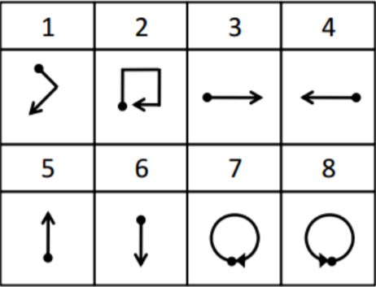

---
jupyter:
  jupytext:
    formats: ipynb,md
    text_representation:
      extension: .md
      format_name: markdown
      format_version: '1.2'
      jupytext_version: 1.6.0
  kernelspec:
    display_name: Python 3
    language: python
    name: python3
---

# Homework 2

```python
import pandas as pd
import numpy as np
import matplotlib.pyplot as plt
from mpl_toolkits.mplot3d import Axes3D
```

```python
# input reading
dataX = pd.read_csv("C:/IE582/train/uWaveGestureLibrary_X_TRAIN.csv",sep=";",header=None)
dataY = pd.read_csv("C:/IE582/train/uWaveGestureLibrary_Y_TRAIN.csv",sep=";",header=None)
dataZ = pd.read_csv("C:/IE582/train/uWaveGestureLibrary_Z_TRAIN.csv",sep=";",header=None)
dataX["axis"] = "x"
dataY["axis"] = "y"
dataZ["axis"] = "z"
dataX["time_seriesID"] = dataX.index+1
dataY["time_seriesID"] = dataY.index+1
dataZ["time_seriesID"] = dataZ.index+1

# concating x,y,z values for gestures
df = pd.concat([dataX,dataY,dataZ],ignore_index=True)

column_names = []
column_names.append("class")
for i in range(1,dataX.shape[1]-2):
    column_names.append(str(i))
column_names.append("axis")
column_names.append("time_seriesID")
df.columns = column_names
df["class"] = df["class"].astype("int64")
df.head()
```

```python
# Transforming data to long format
data =df.set_index(["time_seriesID", "axis","class"]).rename_axis(["time_index"], axis=1).stack().unstack("axis").reset_index().copy()
data["v_x"] = data[data.columns[3]].cumsum()
data["v_y"] = data[data.columns[4]].cumsum()
data["v_z"] = data[data.columns[5]].cumsum()
data.head()
```

```python
# calculation of positions
pos_x = data["v_x"].rolling(2,min_periods=1).sum() / 2
pos_y = data["v_y"].rolling(2,min_periods=1).sum() / 2
pos_z = data["v_z"].rolling(2,min_periods=1).sum() / 2
data["pos_x"] = pos_x
data["pos_y"] = pos_y
data["pos_z"] = pos_z
col = data.pop("class")
data.insert(11, col.name, col)
data.head()
```

## Task a:
Visualize one instance from each class

```python
# function for visualizing gestures
def gesture_visualize(c):
    t = data[data["class"] == c].iloc[0]["time_seriesID"]
    dat = data[(data["class"] == c) & (data["time_seriesID"] == t)]
    fig = plt.figure(figsize = (8, 6))
    ax = plt.axes(projection ="3d")
    sctt = ax.scatter3D(dat["pos_x"],dat["pos_y"],dat["pos_z"],c=dat["time_index"].astype("int64"))
    plt.title("Gesture "+ str(c))
    ax.set_xlabel('X', fontweight ='bold') 
    ax.set_ylabel('Y', fontweight ='bold') 
    ax.set_zlabel('Z', fontweight ='bold')
    fig.colorbar(sctt, ax = ax, shrink = 0.25, aspect = 5)
    plt.show()
```

```python
gesture_visualize(1)
```

```python
gesture_visualize(2)
```

```python
gesture_visualize(3)
```

```python
gesture_visualize(4)
```

```python
gesture_visualize(5)
```

```python
gesture_visualize(6)
```

```python
gesture_visualize(7)
```

```python
gesture_visualize(8)
```

### Comments: 

- In visualization of gesture 1, there are similar points indicating the movement in gesture 1 but hard to understand the correct shape easily. 
- For gesture 2, the corners of the movement can be seen in the visualization.
- Visualizations of gesture 3,4,5 and 6 are not very similar to original shapes but we can see the movement directions easily, e.g. in visualization of gesture 6, there is a movement starting from top to bottom and the opposite is valid for gesture 5.
- We can see circular movements in the visualizations of gesture 7 and 8 as like in the original shapes.




## Task b:
Apply PCA and visualize the reduced dimensions as time series

```python
from sklearn.decomposition import PCA
```

**First I will use all three components in PCA to see that how much variance is explained by each of them.**

```python
pca = PCA(n_components=3)
principalComponents = pca.fit_transform(data[["x","y","z"]])
principalDf = pd.DataFrame(data = principalComponents,columns = ["x","y","z"])
principalDf.head()
```

```python
print("Explained variation per principal component:")
print("x: {}".format(pca.explained_variance_ratio_[0])+"\n" +"y: {}".format(pca.explained_variance_ratio_[1])
      +"\n" +"z: {}".format(pca.explained_variance_ratio_[2]))
```

**It can be seen that explained variation by first principal component, which is x-axis, is higher than others and it is almost 50%. The task is to reduce the data from 3D to 1D, so I will continue with using first principal component to train.**

```python
data.drop(data.columns[8:11],axis=1,inplace=True)
pca = PCA(n_components=1)
principalComponents = pca.fit_transform(data[["x","y","z"]])
principalDf = pd.DataFrame(data = principalComponents,columns = ["x"])
principalDf.head()
```

```python
principalDf.columns = ["pca_x"]
data_score = pd.concat([data,principalDf],axis=1)
data_score.head()
```

**Visualizing two instances from each class**

```python
# function for visualizing two instances of reduced dimensions
def visualize_reduced_dimension(axis,cl,color_ar):
    t = data_score[data_score["class"] == cl].iloc[0]["time_seriesID"]
    data1 = data_score[(data_score["class"] == cl) & (data_score["time_seriesID"] == t)]
    t = data_score[data_score["class"] == cl].iloc[315]["time_seriesID"]
    data2 = data_score[(data_score["class"] == cl) & (data_score["time_seriesID"] == t)]
    plt.plot(data1["time_index"],data1["pca_"+str(axis)],color=color_ar[0])
    plt.xlabel("Time Index")
    plt.ylabel("Pca_"+str(axis))
    plt.xticks([])
    plt.title("Gesture"+str(cl))
    plt.plot(data2["time_index"],data2["pca_"+str(axis)],color=color_ar[1])
    plt.show()
```

```python
visualize_reduced_dimension("x",1,["tab:orange","lime"])
```

```python
visualize_reduced_dimension("x",2,["g","fuchsia"])
```

```python
visualize_reduced_dimension("x",3,["b","r"])
```

```python
visualize_reduced_dimension("x",4,["black","y"])
```

```python
visualize_reduced_dimension("x",5,["purple","aqua"])
```

```python
visualize_reduced_dimension("x",6,["r","y"])
```

```python
visualize_reduced_dimension("x",7,["b","fuchsia"])
```

```python
visualize_reduced_dimension("x",8,["#009E73","r"])
```

### Comments:
- There are similar patterns, e.g. up and down peak points, in time series of instances from the same class; this is valid especially for gesture 1,2,6,7 and 8.
- Time series for different classes seems definable but we know that first principal component is used in PCA and it explains only almost 50% of the total variance, so there are also differences in within class instances.


## Task c:
Apply PCA to each gesture class seperately

```python
# text formatting
from IPython.display import Markdown, display
def printmd(string):
    display(Markdown(string))
```

```python
# function for applying and visualizing pca 
def apply_pca(cl,color_ar):
    # classify data for the given class
    class_data = data[data["class"]==cl].copy()
    #apply PCA with all components
    pca = PCA(n_components=3)
    principalComponents = pca.fit_transform(class_data[["x","y","z"]])
    
    # visualize two instances
    if pca.explained_variance_ratio_[0] == max(pca.explained_variance_ratio_):
        pca = PCA(n_components=1)
        principalComponents = pca.fit_transform(class_data[["x","y","z"]])
        principalDf = pd.DataFrame(data = principalComponents,columns = ["pca_x"])
        data_score = summarize_pca(cl,pca,principalDf)
        visualize_pca(cl,color_ar,data_score,"x")
    elif pca.explained_variance_ratio_[1] == max(pca.explained_variance_ratio_):
        pca = PCA(n_components=1)
        principalComponents = pca.fit_transform(class_data[["x","y","z"]])
        principalDf = pd.DataFrame(data = principalComponents,columns = ["pca_y"])
        data_score = summarize_pca(cl,pca,principalDf)
        visualize_pca(cl,color_ar,data_score,"y")
    elif pca.explained_variance_ratio_[2] == max(pca.explained_variance_ratio_):
        pca = PCA(n_components=1)
        principalComponents = pca.fit_transform(class_data[["x","y","z"]])
        principalDf = pd.DataFrame(data = principalComponents,columns = ["pca_z"])
        data_score = summarize_pca(cl,pca,principalDf)
        visualize_pca(cl,color_ar,data_score,"z")   
    
def summarize_pca(cl,pca,principalDf):
    printmd("**Gesture {}**".format(str(cl)))
    print("Explained variation:")
    print(pca.explained_variance_ratio_)
    data_score = pd.concat([data,principalDf],axis=1)
    return data_score

def visualize_pca(cl,color_ar,data_score,axis):
    t = data_score.iloc[0]["time_seriesID"]
    data1 = data_score[(data_score["time_seriesID"] == t)]
    t = data_score.iloc[315]["time_seriesID"]
    data2 = data_score[(data_score["time_seriesID"] == t)]
    fig=plt.plot()
    plt.plot(data1["time_index"],data1["pca_"+str(axis)],color=color_ar[0])
    plt.xlabel("Time Index")
    plt.ylabel("pca_"+str(axis))
    plt.xticks([])
    plt.title("Gesture"+str(cl))
    plt.plot(data2["time_index"],data2["pca_"+str(axis)],color=color_ar[1])
    plt.show()
```

**Applying PCA to each class**

```python
apply_pca(1,["tab:orange","lime"])
```

```python
apply_pca(2,["g","fuchsia"])
```

```python
apply_pca(3,["b","r"])
```

```python
apply_pca(4,["black","y"])
```

```python
apply_pca(5,["purple","aqua"])
```

```python
apply_pca(6,["r","y"])
```

```python
apply_pca(7,["b","fuchsia"])
```

```python
apply_pca(8,["#009E73","r"])
```

### <ins>Results<ins>

When PCA is applied to **all data**, explained variation per principal component:

| x | y | z |
| --- | --- | --- |
| 0.491 | 0.347 | 0.163 |
    


When PCA is applied to **each gesture class seperately**, explained variation per principal component:

| Class | x | y | z |
| :-: | --- | --- | --- |
| 1 | 0.463 | 0.323 | 0.214 |
| 2 | 0.513 | 0.313 | 0.175 |
| 3 | 0.541 | 0.299 | 0.160 |
| 4 | 0.550 | 0.308 | 0.142 |
| 5 | 0.647 | 0.275 | 0.078 |
| 6 | 0.572 | 0.329 | 0.099 |
| 7 | 0.519 | 0.343 | 0.138 |
| 8 | 0.613 | 0.312 | 0.075 |


- Using the above tables, we can say that, **except for *gesture 1*,** applying PCA to each class seperately gives better results, i.e. explained variation in the first principal component increases. 
- As like the previous task, time series are very similar in gestures 1,2,6,7 and 8.
- For gesture 4, similarities between instances much better compared to previous task result.


## Task d:
Apply multidimensional scaling to distance matrix to represent each time series on a 2-dimensional feature space.

```python
from sklearn.metrics import euclidean_distances
from sklearn.manifold import MDS
```

```python
# Calculation of euclidean distance matrix
x = euclidean_distances(dataX[dataX.columns[1:316]])
y = euclidean_distances(dataY[dataY.columns[1:316]])
z = euclidean_distances(dataZ[dataZ.columns[1:316]])
dist = pd.DataFrame(x+y+z)
dist
```

```python
# applying MDS 
mds = MDS(2, dissimilarity='precomputed')
coords = mds.fit_transform(dist)
mds_data = pd.DataFrame(coords,columns=["x","y"])
mds_data["class"] = df["class"]
mds_data
```

```python
colors = ["g","r","purple","b","y","aqua","lime","tab:orange"]
fig = plt.figure(figsize=(8, 8))
for c in range(1,9):
    plt.scatter(mds_data[mds_data["class"] == c]["x"], mds_data[mds_data["class"] == c]["y"], marker='o',c=colors[c-1],
                edgecolors="black",label=str(c))
plt.xlabel("x",fontweight ='bold')
plt.ylabel("y",fontweight ='bold')
plt.legend(loc='center left', bbox_to_anchor=(1, 0.5),fontsize=12,title="Class")

plt.show()
```

### Comments:
- Gestures 1 and 6 and 4 and 5 are not successfully seperated from each other.
- Gestures 2,7 and 8 are seperated from other classes more successfully.
- Although there are some overlaps between different gesture classes, seperately they are clustered in a good way. 
